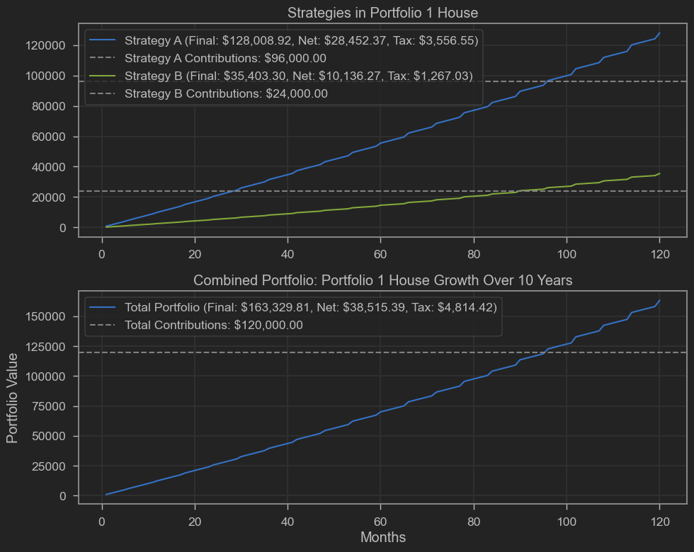
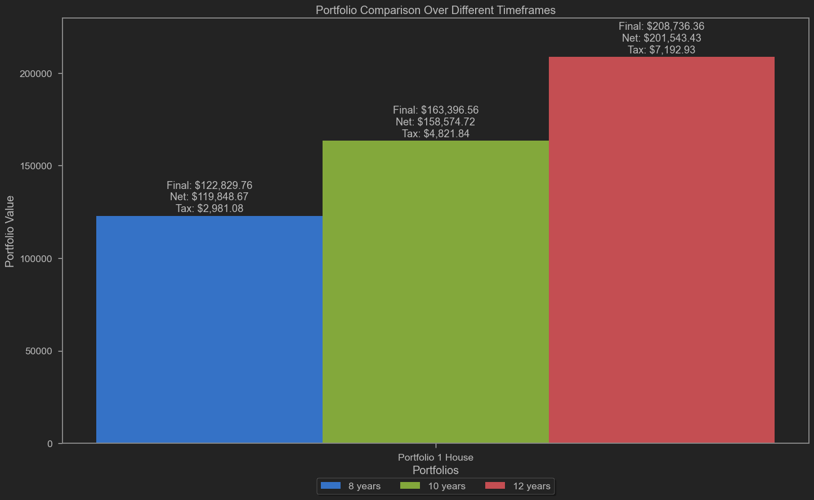

## About

Welcome to the FinancialPortfolio project, your friendly companion for exploring and planning your financial future! 🚀

Are you curious about the performance of your investment strategies, eager to understand how taxes impact your portfolio, or simply looking to make more informed financial decisions? 

**Key Features**:

- 📊 Create and manage portfolios with multiple investment strategies.
- 📈 Calculate future values, net profits, and taxes paid for individual strategies and combined portfolios.
- 📉 Visualize portfolio growth, net profits, and tax implications over time.
- 🔍 Compare the performance of different portfolios across various investment horizons.

Whether you're a seasoned investor or new to the world of finance, the FinancialPortfolio project is here to assist you every step of the way. 

For comprehensive usage instructions and practical examples, please refer to the sections above. If you have any inquiries, ideas, or simply want to engage in discussions about finance, feel free to connect with us or become part of our welcoming community of contributors.


## Table of Contents
- [FinancialPortfolio Class](#financialportfolio-class)
  - [Example Image](#example-image)
  - [Example Portfolios Over Time](#example-portfolios-over-time)
  - [Installation](#installation)
  - [Usage](#usage)
  - [Example Portfolios](#example-portfolios)
  - [Functions](#functions)
  - [Contributing](#contributing)
  - [License](#license)

## Example Image

Here's an example of the portfolio growth chart after 10 years of investment. The chart shows the performance of the "Portfolio 1 House" portfolio with two investment strategies, "Strategy A" and "Strategy B."





## Example Portfolios Over Time

You can use the `plot_portfolios_over_time` function to compare the performance of your portfolios over different timeframes. Below is an example of how to use it with the `example_portfolios`:

```python
plot_portfolios_over_time(example_portfolios, [8, 10, 12], use_default_size=True)
````

The above code will generate a plot that compares the portfolios' performance over 8, 10, and 12 years. You can customize the timeframes to suit your analysis.



In the example image above, you can see how the portfolios "Portfolio 1 House" perform over different time horizons.

Feel free to use this function to analyze and visualize your portfolios' growth and compare their performance over various periods.

## Installation

To use the FinancialPortfolio class, you need to have Python and the required libraries installed. You can install the necessary libraries using pip:

```bash
pip install numpy matplotlib
````

## Usage

To use the FinancialPortfolio class in your Python project, you can simply import it as follows:

```python
from financial_portfolio import FinancialPortfolio, plot_portfolios, display_initial_funds_and_contributions_table
```

Once imported, you can create instances of the `FinancialPortfolio` class and use its functions to analyze and visualize your investment strategies.

## Example Portfolios

In the provided code example, we have an example portfolio named "Portfolio 1 House" with two investment strategies: "Strategy A" and "Strategy B." You can modify and expand these example portfolios to match your specific financial scenarios.

```python
example_portfolios = [
    {
        "name": "Portfolio 1 House",
        "strategies": [
            {"name": "Strategy A", "initial_funds": 0, "monthly_contribution": 800, "annual_rate": 6, "variance": 1, "is_taxable": True, "tax_rate": 10, "compounding_frequency": 6},
            {"name": "Strategy B", "initial_funds": 0, "monthly_contribution": 200, "annual_rate": 8, "variance": 1.5, "is_taxable": True, "tax_rate": 10, "compounding_frequency": 6}
        ]
    }
    # Additional portfolios can be added here
]
```

## Functions

The `FinancialPortfolio` class provides several functions for simulating and visualizing investment strategies and portfolios. These functions include:

- `calculate_aggregated_future_value(years)`: Calculate the aggregated future value of all strategies in the portfolio over a specified number of years.
- `calculate_future_value(strategy, years)`: Calculate the future value of an individual investment strategy over a specified number of years.
- `plot_strategy(strategy, years, ax)`: Plot an individual investment strategy, showing its growth, net profit, and taxes paid over time.
- `plot_combined_portfolio(years, ax)`: Plot the combined value of all strategies in the portfolio, showing the overall portfolio growth, net profit, and total taxes paid.

You can use these functions to analyze and visualize your financial portfolios.

## Contributing

If you have any suggestions or improvements for the FinancialPortfolio class or its documentation, feel free to contribute. You can submit issues or pull requests to help make this class even more useful.

## License

This project is licensed under the MIT License - see the [LICENSE](LICENSE) file for details.

```

You should save this content in a file named `README.md` in your project's repository root directory. Make sure to replace the placeholders with actual content specific to your project. Additionally, you may want to add more sections or information depending on your project's needs.

```
